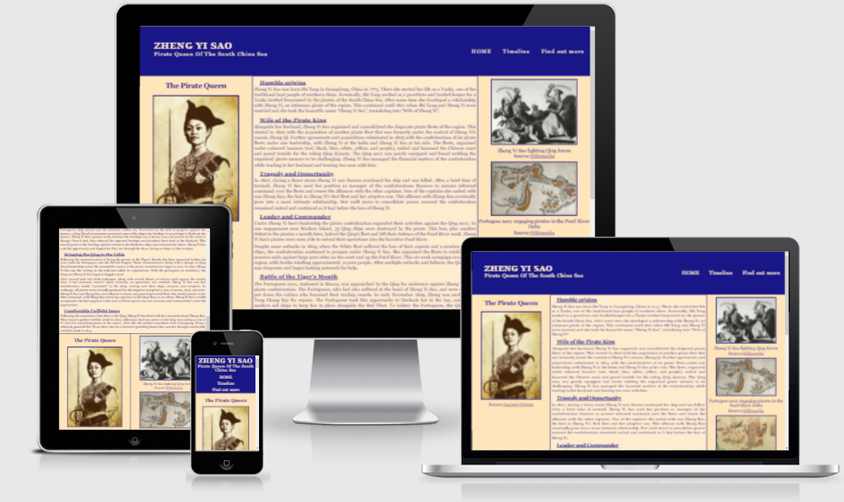

# Zheng Yi Sao

This webiste is built to provide an introduction to the infamous pirate queen, Zheng Yi Sao. It is targeting amateur history enthusiasts and aims to provide a jumping off point to explore the life and exploits of one of the most successful pirates of all time.

# Contents

* [**User Experience**](<#user-experience>)
  * [Wireframes](<#wireframes>)
  * [Site Structure](<#site-structure>)
  * [Design Choices](<#design-choices>)
  * [Colour Scheme](<#colour-scheme>)

* [**Existing Features**](<#existing-features>)

# User Experience

## Wireframes

## Existing Features

### Navigation Bar

  - Featured across all pages of the site, the banner provides the title of the website and the navigation menu. 
  - The links in the navigation menu provide the user with easy movement between pages without needing to use browser navigation tools.
  - The links respond to user hovering over them and the current page is highlighted in the navigation bar to aid user interaction.
  - The navigation bar is responsive to screen size to allow ease of use on mobile and tablet screens.

### Home Page
  - The home page provides initial information for users.
  - Information is divided into sematic elements with a main sections and two asides.
  - A brief biography is found in the central column.
  - The aside columns contain images to provide context to main biography.
  - Images are credited and linked to original source.

### Timeline
  - The timeline displays important events in Zheng Yi Sao's life.
  - Format is clean and simple to follow, with clearly marked dates and descriptions.
  - Side margins are empty to focus on timeline.

### Form and Contact info
  - The form encourages users to sign up to a newsletter.
  - The form leads to a thank you page with navigation back to the main website.
  - Currently the form collects no data.
  - The contact info section encourages users to contact for any questions and provides a (dummy) email address as point of contact.

### Videos
  - The videos are embedded into the page for users to watch.
  - Channels that own the video are highlighted on the page.

### Find out more section
  - The find out more section is divided into two parts, website links and book recommendations.
  - Links provided in the section lead to the corresponding site in a new window.

### Footer
  - The footer provides links to (dummy) social media for users to interact with.

## Desired Features

- An interactive timeline with images displayed when hovering over dates
- Fully functuional form with newsletter delivered to users.

