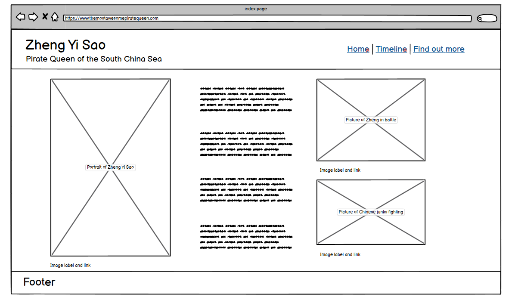

# Zheng Yi Sao - Pirate Queen

This webiste is built to provide an introduction to the infamous pirate queen, Zheng Yi Sao. It is targeting amateur history enthusiasts and aims to provide a jumping off point to explore the life and exploits of one of the most successful pirates of all time.

# Contents

* [**User Experience**](<#user-experience>)
  * [Wireframes](<#wireframes>)
  * [Site Structure](<#site-structure>)
  * [Design Choices](<#design-choices>)
    * [Fonts](<#fonts>)
    * [Colour](<#colour>)

* [**Existing Features**](<#existing-features>)
  * [Navigation Bar](<#navigation-bar>)
  * [Home Page](<#home-page>)
  * [Timeline](<#timeline>)
  * [Form and Contact info](<#form-and-contact-info>)
  * [Videos](<#videos>)
  * [Find out more section](<#find-out-more-section>)
  * [Footer](<#footer>)

* [**Desired Features**](<#desired-features>)

* [**Testing**](<#testing>)
  * [Code Validation](<#code-validation>)
  * [Responsive Design Check](<#responsive-design-check>)
  * [Browser Compatibility](<#browser-compatibility>)
  * [Known Bugs](<#known-bugs>)
    * [Resolved](<#resolved>)
    * [Unresolved](<#unresolved>)
  * [Lighthouse](<#lighthouse>)

* [**Deployment**](<#deployment>)
  * [To deploy the project](<#to-deploy-the-project>)
  * [To fork the repository](<#to-fork-the-repository>)
  * [To create a local clone](<#to-create-a-local-clone>)

* [**Credits**](<#credits>)
  * [Content](<#content>)
  * [Media](<#media>)

# User Experience

## Wireframes

Wireframes for Zheng Yi Sao - Pirate Queen were created using [Balsamiq](https://balsamiq.com). The frames created were for a full width display with a screen wideht of 1440 pixels. Responsive elements were adding during the design process, and future development would include mobile wireframes to improve responsive design accross the site.

[Back to top](<#contents>)

## Site Structure

The website consists of four pages. Three of the pages (Home, Timeline, and Find out more) are accessed through the navigation bar and the forth is a "Thank You" page after submitting the newsletter form. All pages contain the navigation bar for in-site movement between pages.

[Back to top](<#contents>)

## Design Choices

* ### Fonts
    The font selected for the webiste is Georgia to provide a academic look to the site. This will fall back to Times New Roman and Serif sequentially.

[Back to top](<#contents>)

* ### Colour
    The colour scheme used is #ffebcd as a base background colour, with rgba(0, 0, 128, 0.9) for secondary backgrounds and borders. This is to provide a warm screen for pleasent user experience while maintaining good contrast. Text uses rgba(0, 0, 128, 1) (navy keyword) to achieve full contrast. Containers and aside columns use ##ffe5b to stand out against the background colour.

[Back to top](<#contents>)

# Existing Features

## Navigation Bar

  - Featured across all pages of the site, the banner provides the title of the website and the navigation menu. 
  - The links in the navigation menu provide the user with easy movement between pages without needing to use browser navigation tools.
  - The links respond to user hovering over them and the current page is highlighted in the navigation bar to aid user interaction.
  - The navigation bar is responsive to screen size to allow ease of use on mobile and tablet screens.

  

[Back to top](<#contents>)

## Home Page
  - The home page provides initial information for users.
  - Information is divided into sematic elements with a main sections and two asides.
  - A brief biography is found in the central column.
  - The aside columns contain images to provide context to main biography.
  - Images are credited and linked to original source.

  

[Back to top](<#contents>)

## Timeline
  - The timeline displays important events in Zheng Yi Sao's life.
  - Format is clean and simple to follow, with clearly marked dates and descriptions.
  - Side margins are empty to focus on timeline.

  

[Back to top](<#contents>)

## Form and Contact info
  - The form encourages users to sign up to a newsletter.
  - The form leads to a thank you page with navigation back to the main website.
  - Currently the form collects no data.
  - The contact info section encourages users to contact for any questions and provides a (dummy) email address as point of contact.

  

[Back to top](<#contents>)

## Videos
  - The videos are embedded into the page for users to watch.
  - Channels that own the video are highlighted on the page.

  
  
[Back to top](<#contents>)

## Find out more section
  - The find out more section is divided into two parts, website links and book recommendations.
  - Links provided in the section lead to the corresponding site in a new window.

[Back to top](<#contents>)

## Footer
  - The footer provides links to (dummy) social media for users to interact with.

[Back to top](<#contents>)

# Desired Features

- An interactive timeline with images displayed when hovering over dates
- Fully functuional form with newsletter delivered to users.

[Back to top](<#contents>)

# Technologies Used

* [HTML5](https://html.com/html5/)
* [CSS](https://www.w3.org/Style/CSS/Overview.en.html)
* [Balsamiq](https://balsamiq.com/wireframes/)
* [Github](https://github.com)
* [Gitpod](https://www.gitpod.io)

[Back to top](<#contents>)

# Testing

## Code Validation
All code for Zheng Yi Sao - Pirate Queen has been run throught the [W3C HTML validation](https://validator.w3.org/) and the [W3C CSS Validator](https://jigsaw.w3.org/css-validator/). Initial errors were found, removed, and corrected. The validator reported no issues following that.

[Back to top](<#contents>)

* Home Page

* Timeline Page

* Find out more page

* Thank you page

The CSS validator results are below:

[Back to top](<#contents>)

## Responsive Design Check

* The responsive design test was carried out successfully on all pages using [Responsive Design Checker](https://responsivedesignchecker.com)

  * Display >1200px = Pass
  * Display <1200px = Pass
  * Ipad pro (1366x1024px) = Pass
  * Ipad air (768x1024px) = Pass
  * Nexus 7 (600x900px) = Pass
  * Iphone plus (414x736px) = Pass
  * Sony Xperia (360x640px) = Pass
  * Iphone (320x480px) = Pass

[Back to top](<#contents>)

## Browser Compatibility

Zheng Yi Sao - Pirate Queen was tested on the following browsers with no issues to the user.
Opera, Google Chrome, Mozilla Firefox, and Microsoft Edge. Apprearance and responsiveness were consistent accross the browsers and different screen sizes.

[Back to top](<#contents>)

## Known Bugs
* ### Resolved

  * During Validation erros on the Find out more page due to erronious code in the embedded youtube links, these were removed. 
  * Typo with incorrect start and end tags for one of the headings, this was corrected.

* ### Unresolved

  * On repsonsive design for tablet size screens on the timeline and thank you page. The aside columns are not fully hidden above the footer. Time limitations restrain correction.

[Back to top](<#contents>)

## Lighthouse

Zheng Yi Sao - Pirate Queen was tested using the [Lighthouse](https://developers.google.com/web/tools/lighthouse) dev tool program to test the pages for:
* Performance - How the pages run whilst loading.
* Accessibility - Checking how the site is accessible for users.
* Best Practices - Making sure the site fits with industry best practices.
* Seo - Search engine optimisation. Does the site run well with search engine results?

As an example, the results for the Home Page are as follows:

[Back to top](<#contents>)

## Deployment

### **To deploy the project**
This site was deployed using the Github Pages platform. To deploy a site with Pages one must:
 1. In Github's repository, navigate to the **Settings** tab.
 2. Once in the Settings, move to the **Pages** tab in the left-hand navigation column.
 3. Under the **Branch** selector, select the **main** option and the **root** folder, then click **save**.
 4. The site will automatically deploy and a green complete banner will indicate success.

 

### **To fork the repository**
 A copy of the page can be done through forking the Github account. This copy can be viewed and changed without modifying the original. To fork the repository one must:
  1. Log in to **GitHub** and locate the [repository](https://github.com/Miles-Cownie/first-milestone-project)
  2. Select the **fork** option in the top right hand corner of the page to create a copy of the repository.

### **To create a local clone**

  1. Select the **code** tab from the repository's navigation bar.
  2. Choose the **clone** option in the secondary navigation bar and copy the url provided.
  3. In your IDE of your choice open **Git Bash**
  4. Change the current working directory to the location where you want the cloned directory to be made.
  5. Type **git clone**, and then paste the URL copied from GitHub.
  6. Confirm the choice and the local clone will be created.

  [Back to top](<#contents>)

# Credits

### Content

* The font comes from [Google Fonts](https://fonts.google.com/).
* The icons come from [Font Awesome](https://fontawesome.com/).
* [Balsamiq](https://balsamiq.com/wireframes/) was used to create the wireframes.
* The thank you page inspiration and hmtl code guide comes from [rachel_rock_5P_lead](https://rockymiss.github.io/kitchennippers/).
* This readme template and layout comes from [EwanColquhoun](https://github.com/EwanColquhoun/wawaswoods).
* Various code guidence and tutorials from [W3schools](https://www.w3schools.com) to structure the website and guide responsive design.
* Additional code tutorials come from [Code Institute](https://codeinstitute.net).
* The biography and timeline content is drawn from [Wikipedia](https://en.wikipedia.org/wiki/Zheng_Yi_Sao), [World History](https://www.worldhistory.org/Zheng_Yi_Sao/), and [Atlas Obscura](https://www.atlasobscura.com/articles/the-chinese-female-pirate-who-commanded-80000-outlaws).

[Back to top](<#contents>)

### Media

* The portrait comes from [Ancient Origins](https://www.ancient-origins.net)
* The gallery images come from [Wikimedia Commons](https://commons.wikimedia.org/wiki/Main_Page)
* The embedded videos come from [Youtube](https://youtube.com)
* The Book images and links come from [Book Depository](https://www.bookdepository.com) and [Amazon](https://www.amazon.co.uk).

[Back to top](<#contents>)

# Acknowledgements
The site was completed as Portfolio Project 1 for the Diploma in Software Development (E-commerce Applications) with the [Code Institute](https://codeinstitute.net). I would like to thank my mentor [Precious Ijege](https://www.linkedin.com/in/precious-ijege-908a00168/), the Slack community, and all at the Code Institute for their help and support.

Miles Cownie 2022.

[Back to top](<#contents>)